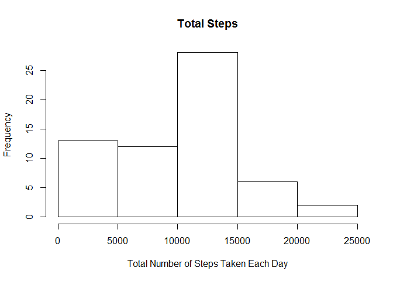
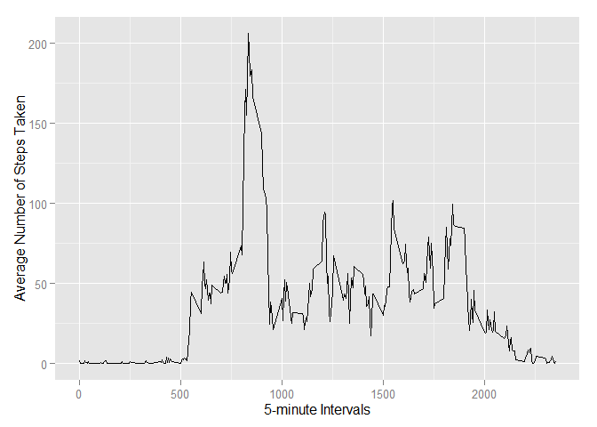
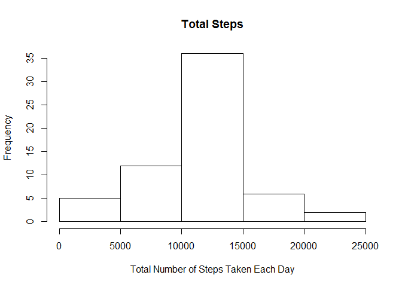
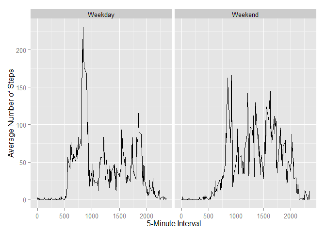

# Reproducible Research: Peer Assessment 1

Load needed packages


```r
libs <- c('dplyr', 'moments', 'ggplot2', 'latticeExtra', 'gridExtra', 'MASS', 
          'colorspace', 'plyr', 'Hmisc', 'scales')
invisible(lapply(libs, require, character.only = T))
```

```
## Loading required package: dplyr
## 
## Attaching package: 'dplyr'
## 
## The following object is masked from 'package:stats':
## 
##     filter
## 
## The following objects are masked from 'package:base':
## 
##     intersect, setdiff, setequal, union
## 
## Loading required package: moments
## Loading required package: ggplot2
## Loading required package: latticeExtra
## Loading required package: RColorBrewer
## Loading required package: lattice
## 
## Attaching package: 'latticeExtra'
## 
## The following object is masked from 'package:ggplot2':
## 
##     layer
## 
## Loading required package: gridExtra
## Loading required package: grid
## Loading required package: MASS
## 
## Attaching package: 'MASS'
## 
## The following object is masked from 'package:dplyr':
## 
##     select
## 
## Loading required package: colorspace
## Loading required package: plyr
## -------------------------------------------------------------------------
## You have loaded plyr after dplyr - this is likely to cause problems.
## If you need functions from both plyr and dplyr, please load plyr first, then dplyr:
## library(plyr); library(dplyr)
## -------------------------------------------------------------------------
## 
## Attaching package: 'plyr'
## 
## The following objects are masked from 'package:dplyr':
## 
##     arrange, count, desc, failwith, id, mutate, rename, summarise,
##     summarize
## 
## Loading required package: Hmisc
## Loading required package: survival
## Loading required package: splines
## Loading required package: Formula
## 
## Attaching package: 'Hmisc'
## 
## The following objects are masked from 'package:plyr':
## 
##     is.discrete, summarize
## 
## The following objects are masked from 'package:dplyr':
## 
##     src, summarize
## 
## The following objects are masked from 'package:base':
## 
##     format.pval, round.POSIXt, trunc.POSIXt, units
## 
## Loading required package: scales
```
Display Environment

```r
sessionInfo()
```

```
## R version 3.1.2 (2014-10-31)
## Platform: x86_64-w64-mingw32/x64 (64-bit)
## 
## locale:
## [1] LC_COLLATE=English_United States.1252 
## [2] LC_CTYPE=English_United States.1252   
## [3] LC_MONETARY=English_United States.1252
## [4] LC_NUMERIC=C                          
## [5] LC_TIME=English_United States.1252    
## 
## attached base packages:
## [1] splines   grid      stats     graphics  grDevices utils     datasets 
## [8] methods   base     
## 
## other attached packages:
##  [1] scales_0.2.4        Hmisc_3.14-6        Formula_1.1-2      
##  [4] survival_2.37-7     plyr_1.8.1          colorspace_1.2-4   
##  [7] MASS_7.3-35         gridExtra_0.9.1     latticeExtra_0.6-26
## [10] lattice_0.20-29     RColorBrewer_1.1-2  ggplot2_1.0.0      
## [13] moments_0.13        dplyr_0.3.0.2      
## 
## loaded via a namespace (and not attached):
##  [1] acepack_1.3-3.3  assertthat_0.1   cluster_1.15.3   DBI_0.3.1       
##  [5] digest_0.6.4     evaluate_0.5.5   foreign_0.8-61   formatR_1.0     
##  [9] gtable_0.1.2     htmltools_0.2.6  knitr_1.8        magrittr_1.5    
## [13] munsell_0.4.2    nnet_7.3-8       parallel_3.1.2   proto_0.3-10    
## [17] Rcpp_0.11.3      reshape2_1.4.1   rmarkdown_0.3.10 rpart_4.1-8     
## [21] stringr_0.6.2    tools_3.1.2      yaml_2.1.13
```

Unzip and Load the data

```r
setwd("C://Users//KathyWarner.KATHYSDESKTOP//Documents//GitHub//RepData_PeerAssessment1")

fileURL<-"./activity.zip"

unzip(zipfile="./activity.zip")

activity <- read.csv("./activity.csv")
```

Make a histogram of the total number of steps taken each day and Calculate and report the mean and median total number of steps taken per day


```r
Totalsteps<-with(activity,(tapply(steps,date,sum, na.rm=TRUE)))

hist(Totalsteps, xlab="Total Number of Steps Taken Each Day", main="Total Steps")
```

 

```r
mean(Totalsteps, na.rm=TRUE)
```

```
## [1] 9354.23
```

```r
median(Totalsteps, na.rm=TRUE)
```

```
## [1] 10395
```

Make a time series plot (i.e. type = "l") of the 5-minute interval (x-axis) and the average number of steps taken, averaged across all days (y-axis)


```r
averages <- aggregate(x=list(steps=activity$steps), by=list(interval=activity$interval),
                      FUN=mean, na.rm=TRUE)
require(ggplot2)
ggplot(data=averages, aes(x=interval, y=steps)) +
        geom_line() +
        xlab("5-minute Intervals") +
        ylab("Average Number of Steps Taken")
```

 

Which 5-minute interval, on average across all the days in the dataset, contains the maximum number of steps?

```r
topAvg<-averages[which.max(averages$steps),]
topAvg
```

```
##     interval    steps
## 104      835 206.1698
```

Calculate and report the total number of missing values in the dataset (i.e. the total number of rows with NAs)


```r
NArows<-apply(activity,1, function(x) is.na(x))

NArows1<-sum(NArows)
```
The total number of rows with NAs is 2304.


The strategy for filling in all of the missing values in the dataset is to use the mean for that 5-minute interval. A new dataset is created that is equal to the original dataset but with the missing data filled in.


```r
averages<-rename(averages, c("steps"="isteps"))
newData<-merge(activity, averages, by="interval")

newData$steps <- ifelse(is.na(newData$steps), newData$isteps, newData$steps)
newData<-newData[,1:3]        
```

Make a histogram of the total number of steps taken each day and Calculate and report the mean and median total number of steps taken per day. Do these values differ from the estimates from the first part of the assignment? 

What is the impact of imputing missing data on the estimates of the total daily number of steps?


```r
Totalsteps1<-with(newData,(tapply(steps,date,sum, na.rm=TRUE)))

hist(Totalsteps1, xlab="Total Number of Steps Taken Each Day", main="Total Steps")
```

 

```r
mean(Totalsteps1, na.rm=TRUE)
```

```
## [1] 10766.19
```

```r
median(Totalsteps1, na.rm=TRUE)
```

```
## [1] 10766.19
```
The impact of imputing missing data on the estimates of the total daily number of steps is an increase in the mean and the median.  Now the mean and median are equal which results in a more symmetrical histogram. 


Create a new factor variable in the dataset with two levels -- "weekday" and "weekend" indicating whether a given date is a weekday or weekend day.

```r
library(lubridate)
```

```
## 
## Attaching package: 'lubridate'
## 
## The following object is masked from 'package:plyr':
## 
##     here
```

```r
newData$date <- as.Date(newData$date)

newData$week<-ifelse(wday(newData$date, label=TRUE)  %in% c("Mon", "Tues", "Wed", "Thurs", "Fri"), 'Weekday', 'Weekend')
newData$steps <- ifelse(is.na(newData$steps), newData$isteps, newData$steps)
newData$week<-as.factor(newData$week)
```

Make a panel plot containing a time series plot (i.e. type = "l") of the 5-minute interval (x-axis) and the average number of steps taken, averaged across all weekday days or weekend days (y-axis). The plot should look something like the following, which was created using simulated data:

```r
newData1 <- aggregate(steps ~ interval + week, data=newData, mean)

class(newData1)
```

```
## [1] "data.frame"
```

```r
g <- ggplot(newData1, aes(x =interval, y = steps))
g + geom_line() + facet_wrap(~week) + 
    labs(x = "5-Minute Interval") + 
    labs(y = "Average Number of Steps") 
```

 
